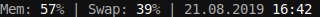
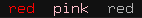
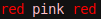
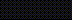
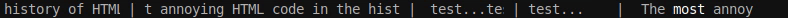
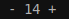
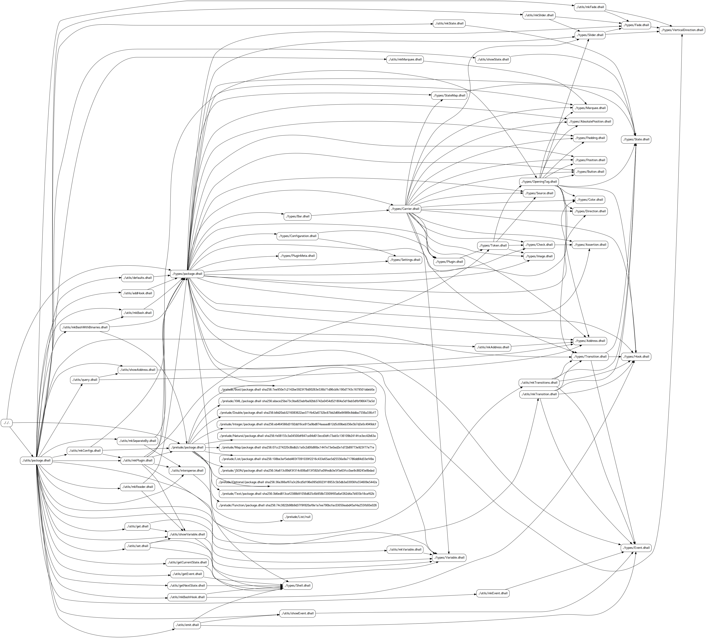

# dzen-dhall

[](https://travis-ci.com/dzen-dhall/dzen-dhall/)


[Dzen](https://github.com/robm/dzen) is a general purpose messaging, notification and menuing program for X11. It features rich in-text formatting & control language, allowing to create GUIs by piping output of arbitrary executables to the `dzen2` binary. There are plenty of good usage examples on [r/unixporn](https://www.reddit.com/r/unixporn/search/?q=dzen&restrict_sr=1).

Unfortunately, combining outputs of multiple executables before feeding them to `dzen2`, which is usually done by custom shell scripts, is a tedious and error-prone task. Consider the following problems:

### Use of newlines

By default, dzen2 only renders the last line of its input, so newlines must be handled somehow by the user.

### Complexity of dynamic text formatting

If one wants each program's output to appear on its own fixed position on the screen, trimming and padding the output of each executable is required, to make sure that the text will not jitter when combined.

### High delays

Some output sources (shell scripts or commands used to provide the data) take too long to produce the output, some change their outputs rarely, but some are expected to update very frequently (like those that output current time or volume indicators on your screen). It means that the `while true; do ...; done | dzen2` pattern is not ideal. Some clever scheduling should be done to avoid delays and excessive resource waste. Output sources should be ran in parallel with their own update intervals.

### No code reuse

It is hard to share pieces of code used to produce output in `dzen2` markup format because of the need to adapt the code. Ideally, there should be a "plugin system" allowing to import reusable configurations with a single command.

### Non-trivial markup is hard

[Dzen in-text format and control language](https://github.com/robm/dzen/blob/488ab66019f475e35e067646621827c18a879ba1/README#L382) is quite rich: it features almost-arbitrary text positioning, text coloring, drawing simple shapes, loading XBM images and even allows to define clickable areas. However, these control structures are too low-level: implementing UI elements we want to use (for example, [marquee](https://developer.mozilla.org/en-US/docs/Web/HTML/Element/marquee)-like blocks with arbitrary content) would require too much effort. Besides, one more problem with this markup language is that nested tags are not supported.

To fill the *abstraction gap*, a new [DSL](https://en.wikipedia.org/wiki/Domain-specific_language) should be introduced. This language should allow its users to abstract away from markup-as-text and focus on markup-as-[syntax-tree](https://en.wikipedia.org/wiki/Abstract_syntax_tree) instead - no need to say, tree structures are more suitable for the purpose of defining UIs. It is also way easier to process tree representations programmatically.

## The solution

[Dhall](https://dhall-lang.org/) is a statically-typed [total](https://en.wikipedia.org/wiki/Total_functional_programming) functional programming language. These properties make it a good choice for dealing with complex user-defined configurations: static typing allows to catch typos and errors early, and totality guarantees that a configuration program will always terminate.

This repository contains data type and function definitions in Dhall that form a DSL for creating almost arbitrary Dzen UIs, called "bars", and a Haskell program capable of reading bar definitions and producing input for `dzen2` binary based on them.

In effect, `dzen-dhall` introduces a new approach to desktop scripting/customization with Dzen. Basically, it provides solutions for all of the aforementioned problems. `dzen-dhall` is smart when formatting text, handles newlines gracefully, runs output sources in parallel, and its [plugin system](#installing-plugins) solves the problem of code reuse.

### Quick example

The essence of the DSL can be illustrated by the following excerpt from [the default config file](dhall/config.dhall) (with additional comments):

```dhall
-- A bar that shows how much memory is used:
let memoryUsage
-- ^ `let` keyword introduces a new binding
	: Bar
	-- ^ Colon means "has type". `memoryUsage` is a `Bar`
	= bashWithBinaries
	  -- ^ Call to a function named `bashWithBinaries` with three arguments:
	  [ "free", "grep", "echo", "awk" ]
	  -- ^ Binaries required to run the script (used to exit early if some of them
	  -- are not present).
	  5000
	  -- ^ Update interval in milliseconds
	  ''
	  TMP=`free -b | grep 'Mem'`
	  TotalMem=`echo "$TMP" | awk '{ print $2; }'`
	  UsedMem=`echo "$TMP" | awk '{ print $3; }'`
	  echo "$((UsedMem * 100 / TotalMem))"
	  ''
	  -- ^ The script itself

-- A bar that shows how much swap is used:
let swapUsage
	: Bar
	= bashWithBinaries
	  [ "free", "grep", "echo", "awk" ]
	  5000
	  ''
	  TMP=`free -b | grep 'Swap'`
	  TotalSwap=`echo "$TMP" | awk '{ print $2; }'`
	  UsedSwap=`echo "$TMP" | awk '{ print $3; }'`
	  echo "$((UsedSwap * 100 / TotalSwap))"
	  ''

-- A bar that shows current date:
let date
	: Bar
	= bashWithBinaries [ "date" ] 1000 "date +'%d.%m.%Y'"

-- A bar that shows current time:
let time
	: Bar
	= bashWithBinaries [ "date" ] 1000 "date +'%H:%M'"

-- A function that colorizes a given `Bar`:
let accent : Bar → Bar = fg "white"

in	separate
    -- ^ a function that inserts |-separators between nearby elements of a list
	[ join [ text "Mem: ", accent memoryUsage, text "%" ]
	-- ^ `join` concatenates multiple `Bar`s
	, join [ text "Swap: ", accent swapUsage, text "%" ]
		  -- ^ `text` is used to convert a text value to a `Bar`
	, join [ date, text " ", accent time ]
	] : Bar
```

This definition results in the following Dzen output:



## Getting started

### Building

#### Using [stack](https://docs.haskellstack.org/en/stable/README/)

```
stack build
```

#### Using [Nix](https://nixos.org/nix/)

```
nix-build --attr dzen-dhall
```

To use pinned version of nixpkgs, pass `--arg usePinned true`.

### Installing

[Binary releases](https://github.com/dzen-dhall/dzen-dhall/releases) are available.

#### Using [stack](https://docs.haskellstack.org/en/stable/README/)

```
stack install
```

#### Using [Nix](https://nixos.org/nix/)

```
nix-env --file default.nix --install dzen-dhall
```

To use pinned version of nixpkgs, pass `--arg usePinned true`.

### Running

To create a default configuration, run:

```
dzen-dhall init
```

`dzen-dhall` will put some files to `~/.config/dzen-dhall/`

Files in `types/` and `utils/` subdirectories are set read-only by default - the user should not edit them, since they contain the implementation. They are still exposed to simplify learning and debugging. `prelude/` directory contains a copy of [Dhall prelude](https://github.com/dhall-lang/dhall-lang/tree/cf263a128d4e2e25afb3187cb8b243e7e68af9fb/Prelude).

## Installing plugins

`dzen-dhall` comes with a plugin system capable of pulling pieces of Dhall code with metadata either from a [curated set of plugins](https://github.com/dzen-dhall/plugins) or from third-party sources.

For example, let's install [a plugin named `tomato`](https://github.com/dzen-dhall/plugins#tomato), which is a countdown timer with interactive UI.

Running `dzen-dhall plug tomato` will result in fetching the plugin source from [this file](https://github.com/dzen-dhall/plugins/blob/master/tomato/plugin.dhall) and pretty-printing it to the terminal for review. You will be prompted for confirmation, and if you confirm the installation, you will see the following output:

```
New plugin "tomato" can now be used as follows:

let tomato = (./plugins/tomato.dhall).main

in  plug
  ( tomato
        ''
        notify-send --urgency critical " *** Time is up! *** "
        ''
  )
```

This is a message the author left for you, to demonstrate how to actually use their plugin.

Navigate to your [`config.dhall`](https://github.com/dzen-dhall/dzen-dhall/blob/master/dhall/config.dhall), find a comment saying `You can add new plugins right here` and insert the expression from above instead of the comment (don't forget to also add a leading comma).

After running `dzen-dhall` again, you should be able to see the output of the newly installed plugin.

## Modifying configuration

This chapter describes `dzen-dhall` DSL in depth. It's best to read the [Dhall wiki](https://github.com/dhall-lang/dhall-lang/wiki) to become familiar with Dhall syntax before you proceed.

### [Bars](dhall/src/Bar.dhall)

The most important concept of the DSL is `Bar`. Essentially, `Bar` is a tree data structure containing text, images, shapes, etc. in its leaves. [Default config file](dhall/config.dhall) exposes some functions for working with `Bar`s:

<big><pre>
-- [Text primitives](#text-primitives):
let text : Text → Bar
let markup : Text → Bar

-- Used to combine multiple Bars into one.
let join : List Bar → Bar

-- [Primitives of Dzen markup language](#primitives):
let [fg](#coloring) : Color → Bar → Bar
let [bg](#coloring) : Color → Bar → Bar
let [i](#drawing-images) : Image → Bar
let [r](#drawing-shapes) : Natural → Natural → Bar
let [ro](#drawing-shapes) : Natural → Natural → Bar
let [c](#drawing-shapes) : Natural → Bar
let [co](#drawing-shapes) : Natural → Bar
let [p](#relative-positioning) : Position → Bar → Bar
let [pa](#absolute-positioning) : AbsolutePosition → Bar → Bar
let [ca](#clickable-areas) : Button → Shell → Bar → Bar
let [ib](#ignoring-background-color) : Bar → Bar

-- [Animations](#animations)
let [slider](#sliders) : Slider → List Bar → Bar
let [marquee](#marquees) : Marquee → Bar → Bar

-- Other
let [pad](#padding-text) : Natural → Padding → Bar → Bar
let [trim](#trimming-text) : Natural → Direction → Bar → Bar
let [source](#sources) : Source → Bar
let [plug](#plugins) : Plugin → Bar
let [automaton](#automata) : Text → StateTransitionTable → [StateMap](#state-maps) Bar → Bar
let [check](#assertions) : List [Check](#assertions) → Bar
let [define](#variables) : Variable → Text → Bar
let [scope](#scopes) : Bar → Bar
</pre></big>

### Text primitives

`text` is used to create `Bar`s containing static, escaped pieces of text. `markup`, on the contrary, does not escape its input, so that if it does contain markup, it will be interpreted by dzen2.

### Primitives

Various primitives of dzen2 markup language (`^fg()`, `^bg()`, `^i()`, etc. - see [dzen2 README](https://github.com/robm/dzen) for details on them) are represented by corresponding `Bar` constructors (`fg`, `bg`, `i`, etc.).

#### Coloring

Background and foreground colors can be set using `bg` and `fg`. A color can be one of the following:

- [X11 color name](https://en.wikipedia.org/wiki/X11_color_names);
- `#XXX`-formatted hex number;
- `#XXXXXX`-formatted hex number.

`fg` can also be used to set colors of [XBM bitmaps](#drawing-images).

`dzen-dhall` color blocks can be nested (unlike when using plain dzen2 markup). `^fg(red) red ^fg(pink) pink ^fg() red ^fg()` will be rendered by dzen2 as . But `dzen-dhall` will process `fg "red" (join [ text "red ", fg "pink" (text "pink"), text " red" ])` as .

#### Ignoring background color

`ib` can be used to completely disable background coloring for a region of output. Background coloring can't be enabled again from within a child `Bar`.

For example, this:

```dhall
bg
("#F00")
( join
[ text "..."
, ib
  ( join
	[ text "background color is "
	, bg ("#0F0") (text "completely")
	, text "ignored"
	]
  )
, text "..."
]
)
```

results in the following output:


#### Drawing images

[XBM bitmaps](https://www.fileformat.info/format/xbm/egff.htm) can be loaded using `i` function.

`i` accepts both filenames and raw image contents (XBM images are just pieces of C code):

For example,

```dhall
i
''
#define smiley_width 15
#define smiley_height 15
static unsigned char smiley_bits[] = {
   0x00, 0x00, 0x00, 0x00, 0xc8, 0x00, 0xcc, 0x00, 0x4c, 0x00, 0x48, 0x00,
   0x00, 0x00, 0x00, 0x08, 0x00, 0x08, 0x04, 0x04, 0x3c, 0x07, 0xe0, 0x01,
   0x00, 0x00, 0x00, 0x00, 0x00, 0x00 };
''
```

will be rendered as .

To edit/create XBM images, use [GIMP](https://www.gimp.org/).

#### Drawing shapes

Four types of shapes are supported:

| Function | Meaning           |
|----------|-------------------|
| `r`      | Rectangle         |
| `ro`     | Rectangle outline |
| `c`      | Circle            |
| `co`     | Circle outline    |

#### Relative positioning

Relative positioning (`p`) allows to shift by some number of pixels in any direction, reset vertical position, lock or unlock horizontal position, or move to one of the four edges of the screen:

```dhall
let Position
	: Type
	= < XY :
		  { x : Integer, y : Integer }
	  | _RESET_Y
	  | _LOCK_X
	  | _UNLOCK_X
	  | _LEFT
	  | _RIGHT
	  | _TOP
	  | _CENTER
	  | _BOTTOM
	  >
```

For example, `(p (Position.XY { x = +10, y = -5 }) (text "Relative position"))`.

#### Absolute positioning

With `pa` function, it is possible to specify absolute position of a bar, relative to the top-left corner of the screen.

`AbsolutePosition` is defined as:

```dhall
let AbsolutePosition : Type = { x : Integer, y : Integer }
```

Example:

```dhall
(pa { x = +0, y = +0 } (text "Absolute position"))
```

#### Clickable areas

Example:

```dhall
(ca Button.Left "notify-send hello!" (text "Click me!"))
```

`dzen2` does not allow a command in `^ca()` tag to contain closing parentheses, because `)` is used to indicate the end of the command. `dzen-dhall` bypasses this limitation:

```dhall
(ca Button.Left "notify-send '(even with parentheses)'" (text "Click me!"))
```

##### Buttons

`Button` is defined as:

```dhall
let Button : Type = < Left | Middle | Right | ScrollUp | ScrollDown | ScrollLeft | ScrollRight >
```

### Animations

Some built-in animations are available. More may be added in the future.

#### Sliders

Sliders change their outputs, variating between `Bar`s from a given list. Transitions are rendered smoothly.

E.g., the following piece:


```dhall
let fadeIn : Fade = mkFade VerticalDirection.Up 5 16
       -- How many frames to spend on switching ^

let fadeOut : Fade = mkFade VerticalDirection.Down 5 16
    -- How many pixels up or down to move the output ^

in	slider
	(mkSlider fadeIn fadeOut 3000)
                -- Delay, ms ^

	[ join [ text "Mem: ", accent memoryUsage, text "%" ]
	, join [ text "Swap: ", accent swapUsage, text "%" ]
	]
	: Bar
```

[[view complete example]](test/dhall/configs/sliders.dhall)

results in this output:




#### Marquees

Marquee animation type is inspired by the [deprecated marquee HTML tag](https://developer.mozilla.org/en-US/docs/Web/HTML/Element/marquee).

This example with multiple marquees shows how various settings affect appearance:

```dhall
separate
[ marquee
  (mkMarquee 5 15 False)
          -- ^ Number of animation frames per character.
  ( text
    "The most annoying HTML code in the history of HTML codes."
  )

  , marquee
  (mkMarquee 0 32 True)
            -- ^ Number of characters to show.
  ( text
    "The most annoying HTML code in the history of HTML codes."
  )

  , marquee (mkMarquee 3 10 True) (text "test...")
                         -- ^ Whether to repeat the input indefinitely
                         -- if it is too short, or just pad it with spaces
  , marquee (mkMarquee 3 10 False) (text "test...")

  -- A demo with colors:
  , marquee
  (mkMarquee 8 15 False)
  ( join
    [ text "The "
    , fg "white" (text "most ")
    , text "annoying "
    , fg "white" (text "HTML ")
    , text "code "
    , fg "white" (text "in ")
    , text "the "
    , fg "white" (text "history ")
    , text "of "
    , fg "white" (text "HTML ")
    , text "codes. "
    ]
  )
]
```

[[view complete example]](test/dhall/configs/marquees.dhall)

The output:



Obviously, marquees and sliders can be nested within each other.

### Padding text

Paddings allow to make sure that the width of a piece of text is no less than some number of characters.

```dhall
let Padding : Type = < Left | Right | Sides >
```

Example:

```dhall
(pad 30 Padding.Sides (text "...")) : Bar
```

### Trimming text

`trim` function allows to cut a given `Text` to desired width, removing excessive characters from either left or right.

Trim direction is defined as follows:

```dhall
let Direction = < Left | Right >
```

Example:

```dhall
(trim 5 Direction.Right (text "Some long text..."))
```

### Sources

Sources are arbitrary commands that generate text output for `dzen-dhall`.

```dhall
let Source : Type =
  { command : List Text
  , input : Text
  , updateInterval : Optional Natural
  , escape : Bool
  }
```

For example, a simple clock plugin can be created as follows:

```dhall
let clocks : Source =
  { updateInterval = Some 1000
  , command = ["date", "+%H:%M"]
  , input = ""
  , escape = True
  }
```

`updateInterval` specifies *minimum* update interval: new source command will not be spawned if a previous one is still running (this is done to avoid race conditions). Actual time intervals between source command invocations are adjusted to be as close to specified `updateInterval`s as possible. For example, if running a command takes 100ms and `updateInterval` is set to `1000`, the real delay between command's exit and startup will be 900ms. And if it takes more than 1000ms, then the real delay will be zero.

If `updateInterval` is not specified (i.e. set to `None Natural`), the command will run once. It may continue generating output indefinitely, line-by-line, or exit - in the latter case, the last line of the output will be shown forever.

Note that in most cases it's better to use `bash` or `bashWithBinaries` functions instead of constructing sources by hand.

### Variables

[Sources](#sources), [hooks](#hooks) and [clickable areas](#clickable-areas) can access and modify [scope-local](#scopes) variables, using `mkVariable`, `define`, `set` and `get` functions.

```dhall
let mkVariable : Text → Variable
let define : Variable → Text → Bar
let get : Variable → Shell
let set : Variable → Shell → Shell
```

The last two don't actually do anything with variables, they rather construct shell commands that do. `dzen-dhall` works like a template engine for bash scripts.

For example, let's see how a simple stateful counter can be implemented:

```dhall
let var = mkVariable "MyVariable"

in	join
  [ define var "0"
  -- ^ set a default value (optional)

  , ca
	Button.Left
	''
	shellVar=${get var}
	${set var "$(( shellVar - 1 ))"}
	''
	(text "-")
  -- ^ a button that decreases the value

  , bash 500
    ''
    echo " ${get var} "
    ''
  -- ^ a bar that prints the value

  , ca
	Button.Left
	''
	shellVar=${get var}
	${set var "$(( shellVar + 1 ))"}
	''
	(text "+")
  -- ^ a button that increases the value

  ]
```

[[view complete example]](test/dhall/configs/variables.dhall)

At run time, it will look like this: .

### Scopes

Scopes are used for encapsulation. `dzen-dhall` guarantees that automata from different scopes are unable to communicate with each other, and that there are no variable collisions between scopes. Parent scopes are completely isolated from child scopes and vice versa.

For example, let's revisit our [counter example](#variables) from README section about variables.

What if we wanted multiple counters to be present on the screen at the same time? Just inserting many of them is not enough: they will be using the same variable.

But wrapping them into separate scopes helps:

```dhall
let counter =
	  join
	  [ define var "0"
	  , ca
		Button.Left
		''
		shellVar=${get var}
		${set var "\$(( shellVar - 1 ))"}
		''
		(text "-")
	  , bash 500 "echo \" ${get var} \""
	  , ca
		Button.Left
		''
		shellVar=${get var}
		${set var "\$(( shellVar + 1 ))"}
		''
		(text "+")
	  ]

in	join [ scope counter, scope counter ]
```

[[view complete example]](test/dhall/configs/scopes.dhall)

### Automata

Each [Bar](#bars) is essentialy a finite-state automaton. States are tagged by `Text` labels, and transitions are triggered by [events](#events) (very much like in some functional reactive programming frameworks). In the trivial case, a bar has only one state: you can think of any static `Bar` as of an automaton with a single state, the name of which is implicit.

A bar with more than one state can be defined by its state transition function (in a form of a list of transitions), a mapping from state labels to `Bar`s (`StateMap`), which specifies visual representation of the automaton for various states, and a special identifier (`Address`) used to query the state of the automaton from the outside world.

For example, this code snippet defines a bar that switches between two states, `ON` and `OFF`:

```dhall
let OFF : State = mkState ""
                       -- ^ Empty label means that this state is initial.
let ON : State = mkState "ON"

let Toggle : Event = mkEvent "Toggle"

let address : Address = mkAddress "MY_AUTOMATON"

let stateTransitionTable
	: List Transition
	= [ mkTransition Toggle ON OFF, mkTransition Toggle OFF ON ]

-- Defines which output to render depending on the state:
let stateMap : StateMap Bar
	= [ { state = OFF, bar = text "Switcher is OFF" }
	  , { state = ON,  bar = text "Switcher is ON" }
	  ]

-- A clickable area that reacts to left-clicks by emitting `Toggle` events:
in	ca
	Button.Left
	(emit Toggle)
	(automaton address stateTransitionTable stateMap)
```

#### [State maps](dhall/src/StateMap.dhall)

`StateMap`s are used to define mappings from states to bars, i.e. they determine what to show depending on the state.

```dhall
let StateMap : Type → Type = λ(Bar : Type) → List { state : Text, bar : Bar }

in  StateMap
```

Note that `StateMap` is parametrized by the `Bar` type.

Also note that unlike in traditional reactive frameworks, current state of an automaton only determines which `Bar` is *shown*, not *present in the tree*. See [this section](#deduplication) for more context.

#### [Events](dhall/src/Event.dhall)

Events can be emitted from within [hooks](#hooks), [sources](#sources) and [clickable areas](#clickable-areas). The only way to react to some event is to use an automaton.

```dhall
let mkEvent : Text → Event

let emit : Event → Shell
```

#### [Hooks](dhall/src/Hook.dhall)

Hooks allow to execute arbitrary commands before state transitions of automata. When a hook exits with non-zero code, it prevents its corresponding state transition from happening. So, generally, hooks should only contain commands that exit fast, to prevent excessive delays.

Relevant bindings include:

```dhall
let Hook
	: Type
	= { command :
		  List Text
	  , input :
		  Text
	  }

let mkBashHook
	: Shell → Hook

let addHook
	: Hook → Transition → Transition

let getEvent : Shell

let getCurrentState : Shell = utils.getCurrentState

let getNextState : Shell = utils.getNextState
```

For example, The following hook will succeed only if a certain file exists:

```dhall
let myHook : Hook =
  { command = "bash"
  , input = "[ -f ~/some-file ]"
  }
```

Hooks can also [emit events](#events) themselves (this may lead to event storm, so the user should be really careful).

A special value, `getEvent`, allows to get the name of the event that triggered the hook. Similarly, `getCurrentState` and `getNextState` contain values from the corresponding row of a state transition table.

For example, a hook that inspects current event and both states can be added to all transitions of a state transition table from the [automata example](#automata):

```dhall
let withInspect
	: Transition → Transition
	= addHook (mkBashHook "notify-send \"${getEvent}: ${getCurrentState} -> ${getNextState}\"")

let stateTransitionTable
	: List Transition
	= prelude.List.map
	  Transition
	  Transition
      -- ^ Type parameters like these are always explicit in Dhall
	  withInspect
	  [ mkTransition Toggle ON OFF, mkTransition Toggle OFF ON ]
```

[[view complete example]](test/dhall/configs/getEvent.dhall)

### Assertions

Startup-time assertions allow to make sure that some condition is true before proceeding to the execution. It is possible to assert that some binary is in `$PATH` or that some arbitrary shell command exits successfully:

```dhall
let Assertion = < BinaryInPath : Text | SuccessfulExit : Text >
```

A `message` will be printed to the console on assertion failure. Assertions, when used wisely, greatly reduce debugging time.

For example, this assertion fails if there's no `something` binary in `$PATH`:

```dhall
check
  "Did you miss something?"
  (Assertion.BinaryInPath "something")
```

And this assertion fails on weekends:

```dhall
check
  "Not going to work!"
  (Assertion.SuccessfulExit "[[ \$(date +%u) -lt 6 ]]")
```

[[view complete example]](test/dhall/configs/assertions.dhall)

## Code structure overview

The image below contains an import tree for `config.dhall`. It was generated using `dhall resolve --dot`.

[](https://raw.githubusercontent.com/dzen-dhall/dzen-dhall/master/img/graph.png)

## Naming conventions

These conventions are enforced by `dzen-dhall` as an attempt to lower cognitive noise for users and plugin maintainers.

- [Event](#events) names and [variables](#variables) should be written camel-cased, first letter capitalized: `TimeHasCome`, `ButtonClicked`, etc.
- [Automata](#automata) addresses should contain only capital letters, numbers and `_`.

## Troubleshooting

This section is dedicated to fixing problems with your `dzen-dhall` configurations.

### Getting more info about errors

Pass `--explain` flag to turn on verbose error reporting.

### Marquee jittering

Jittering may appear if the value of `fontWidth` field in your settings is inadequate. It can be fixed by specifying the width manually:

```dhall
[ { bar = ...
  , settings = defaults.settings ⫽ { fontWidth = 10 }
  }
]
```

After a few guesses, you should be able to get rid of jittering.

Another possible source of this problem is a non-monospace font being used. Non-monospace fonts are not supported and will never be.

### Embedding shell scripts in Dhall

The most straightforward way is to use [`./file.sh as Text` construct](https://github.com/dhall-lang/dhall-lang/wiki/Cheatsheet#programming) to embed a file as `Text` literal into the configuration. However, it is not possible when creating reusable plugins, since it is a requirement that each plugin is encapsulated in a single file, and using string interpolation with `as Text` is impossible too.

So, the following rules apply:

1. Use `\` to escape `${` `}` in a single-line (`"`-quoted) string.

2. Use `''` to escape `${` `}` in a multiline (`''`-quoted) string. (That is, `''` serves as both an escape sequence and a quote symbol).

For example, bash array expansion expression `${arr[ ix ]}` should be written as `"\${arr[ ix ]}"` in a double-quoted string or as `'' ''${arr[ ix ]} ''` in a multiline string.

See [the specification](https://github.com/dhall-lang/dhall-lang/blob/master/standard/multiline.md) for details.

### Running multiple `dzen2`s simultaneously

It is possible to do so by adding another `Bar` (some code duplication is hardly avoidable) and adding another entry to the configuration list:

```dhall
mkConfigs
	  [ { bar = defaultBar, settings = defaults.settings }
	  , { bar =
		    anotherBar
		, settings =
			-- `-xs` dzen2 argument specifies monitor number:
			defaults.settings ⫽ { extraArgs = [ "-xs", "1" ] }
		}
	  ]
```

## Implementation details

Read this section if you want to understand how `dzen-dhall` works. It is not required if you want to just use the program.

### Data encoding

Dhall does not support recursive ADTs (which are obviously required to construct tree-like statusbar configurations), but there is a [trick](https://github.com/dhall-lang/dhall-lang/wiki/How-to-translate-recursive-code-to-Dhall) to bypass that, called [Boehm-Berarducci encoding](http://okmij.org/ftp/tagless-final/course/Boehm-Berarducci.html).

We use this method in a slightly modified variant: [`Carrier`](dhall/src/Carrier.dhall) type is introduced to hide all the constructors in a huge record.

Essentially, [our definition of `Bar`](dhall/src/Bar.dhall) is equivalent to something like the following, which is a direct Boehm-Berarducci encoding:

```dhall
let Bar =
      ∀(Bar : Type)
    → ∀(text : Text → Bar)
    → ∀(markup : Text → Bar)
    → ∀(join : List Bar → Bar)
    -- ... some constructors omitted
    → ∀(check : List Check → Bar)
    → Bar
```

During the stage of [config](dhall/config.dhall) processing, `Bar`s are converted to a type called [Plugin](dhall/src/Plugin.dhall), which is a list of [Token](dhall/src/Token.dhall)s (in fact, `List` is the only recursive data type in Dhall). These tokens can be marshalled into Haskell, and then [parsed back](src/DzenDhall/Parser.hs) into a tree structure ([DzenDhall.Data.Bar](src/DzenDhall/Data.hs)).

After that, `dzen-dhall` [spawns some threads](src/DzenDhall/App/StartingUp.hs) for each output source and processes the outputs as specified in the configuration.

### Deduplication

This is a really tricky part: identical-by-definition sources or automata within the same scope are always treated as a single one, no matter how many times they appear in a `Bar` tree.

A simplest example that makes deduplication observable can be found [here](test/dhall/configs/deduplication.dhall).

Deduplication was introduced to handle gracefully the situation where we have an automaton with a `StateMap` of multiple states, some of which contain the same sources and/or automata. Do we want to create these duplicating things for each possible state? Of course, not: this is like saying no to performance from the start. The chosen solution was to just remove these duplicates from runtime.

The reason why we have to deal with this problem at all (while normal reactive frameworks don't have to) is because all sources in a `StateMap` are being run at the same time in background (no matter in which state the automaton is), but the user is only able to observe the output corresponding to exactly one state. This may seem strange, but in fact this approach has its own benefits. For example, output is always available immediately after a state change. And the implementation is much simpler, because there is no need to kill output sources and launch them anew.

If you want "normal" behavior, it's not hard to define an automaton that does not contain sources in its `StateMap` at all, and define a single output source that queries the state of this automaton and switches between various outputs. Of course, you may ask, "what if I want to render complex markup that changes depending on the state?". The answer is that you just have to put your automaton back in a `StateMap` wherever you want it to appear, possibly duplicating it multiple times in various contexts - and at runtime it will be deduplicated!
