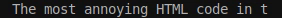

# dzen-dhall

[](https://travis-ci.com/dzen-dhall/dzen-dhall/)

[Dzen](https://github.com/robm/dzen) is a general purpose messaging, notification and menuing program for X11. It features rich in-text formating & control language, allowing to create GUIs by piping output of arbitrary executables to the `dzen2` binary. There are plenty of good usage examples on [r/unixporn](https://www.reddit.com/r/unixporn/search/?q=dzen&restrict_sr=1).

Unfortunately, combining outputs of multiple executables before feeding them to `dzen2`, which is usually done by custom shell scripts, is a tedious and error-prone task. Consider the following problems:

### Use of newlines

By default, dzen2 only renders the last line of its input, so newlines must be handled somehow by the user.

### Complexity of dynamic text formatting

If one wants each program's output to appear on its own fixed position on the screen, trimming and padding the output of each executable is required, to make sure that the text will not jitter when combined.

### High delays

Some output sources (shell scripts or commands used to provide the data) take too long to produce the output, some change their outputs rarely, but some are expected to update very frequently (like those that output current time or volume indicators on your screen). It means that the `while true; do ...; done | dzen2` pattern is not ideal. Some clever scheduling should be done to avoid delays and excessive resource waste. Output sources should be ran in parallel with their own update intervals.

### No code reuse

It is hard to share pieces of code used to produce output in `dzen2` markup format because of the need to adapt the code. Ideally, there should be a "plugin system" allowing to import reusable configurations with a single command.

### Non-trivial markup is hard

Dzen markup language is quite rich: it features almost-arbitrary text positioning (using `^p` command), text coloring (`^fg`, `^bg`), drawing shapes (`^c`, `^co`, `^r`, `^ro`), loading XBM images (`^i`) and even allows to define clickable areas (`^ca`). However, these control structures are too low-level: implementing UI elements we want to use (for example, [marquee](https://developer.mozilla.org/en-US/docs/Web/HTML/Element/marquee)-like blocks with arbitrary content) would require too much effort. Besides, one more problem with this markup language is that nested tags are not supported.

To fill the *abstraction gap*, a new [DSL](https://en.wikipedia.org/wiki/Domain-specific_language) should be introduced. This language should allow its users to abstract away from markup-as-text and focus on markup-as-[syntax-tree](https://en.wikipedia.org/wiki/Abstract_syntax_tree) instead - no need to say, tree structures are more suitable for the purpose of defining UIs. It is also way easier to process tree representations programmatically.

## The solution

[Dhall](https://dhall-lang.org/) is a statically-typed [total](https://en.wikipedia.org/wiki/Total_functional_programming) functional programming language. Its unique properties make it a good choice for dealing with complex user-defined configurations: static typing allows to catch typos and errors early, and totality guarantees that a configuration program will never hang. Unlike some other configuration languages, it requires very little learning (even for people with no background in functional programming).

This repository contains data type and function definitions in Dhall that form a DSL for defining almost arbitrary Dzen UIs, called "bars", and a Haskell program capable of reading bar definitions and producing input for `dzen2` binary based on them.

In effect, `dzen-dhall` introduces a new approach to desktop scripting/customization with Dzen. Basically, it provides solutions for all of the aforementioned problems. `dzen-dhall` is perfect at formatting text, handles newlines gracefully, allows to run output sources in parallel, and its [plugin system](#installing-plugins) makes code reuse no more a problem.

### Quick example

The essence of the DSL can be illustrated by the following excerpt from [the default config file](dhall/config.dhall) (with additional comments):

```dhall
-- A bar that shows how much memory is used:
let memoryUsage
-- ^ `let` keyword introduces new binding
	: Bar
	-- ^ Colon means "has type". `memoryUsage` is a `Bar`
	= bashWithBinaries
	  -- ^ Call to a function named `bashWithBinaries` with three arguments:
	  [ "free", "grep", "echo", "awk" ]
	  -- ^ Binaries required to run the script (used to exit early if some of them
	  -- are not present).
	  5000
	  -- ^ Update interval in milliseconds
	  ''
	  TMP=`free -b | grep 'Mem'`
	  TotalMem=`echo "$TMP" | awk '{ print $2; }'`
	  UsedMem=`echo "$TMP" | awk '{ print $3; }'`
	  echo "$((UsedMem * 100 / TotalMem))"
	  ''
	  -- ^ The script itself

-- A bar that shows how much swap is used:
let swapUsage
	: Bar
	= bashWithBinaries
	  [ "free", "grep", "echo", "awk" ]
	  5000
	  ''
	  TMP=`free -b | grep 'Swap'`
	  TotalSwap=`echo "$TMP" | awk '{ print $2; }'`
	  UsedSwap=`echo "$TMP" | awk '{ print $3; }'`
	  echo "$((UsedSwap * 100 / TotalSwap))"
	  ''

-- A bar that shows current date and time:
let clocks
	: Bar
	= bashWithBinaries [ "date" ] 1000 "date +'%d.%m.%Y %A - %H:%M:%S'"

in  separate
    -- ^ a function that inserts a |-separator between nearby elements of a list
	[ join [ text "Mem: ", memoryUsage, text "%" ]
           -- ^ `text` is used to convert a text value to a `Bar`
	, join [ text "Swap: ", swapUsage, text "%" ]
	-- ^ `join` concatenates multiple `Bar`s
	, clocks
	] : Bar
```

This definition results in the following Dzen output:


## Getting started

### Building

#### Using [stack](https://docs.haskellstack.org/en/stable/README/)

```
stack build
```

#### Using [Nix](https://nixos.org/nix/)

```
nix-build --attr dzen-dhall
```

To use pinned version of nixpkgs, pass `--arg usePinned true`.

### Installing

#### Using [stack](https://docs.haskellstack.org/en/stable/README/)

```
stack install
```

#### Using [Nix](https://nixos.org/nix/)

```
nix-env --file default.nix --install dzen-dhall
```

To use pinned version of nixpkgs, pass `--arg usePinned true`.

### Running

To create a default configuration, run:

```
dzen-dhall init
```

`dzen-dhall` will put some files to `~/.config/dzen-dhall/`

Files in `src/` and `lib/` subdirectories are set read-only by default - the user should not edit them, since they contain the implementation. They are still exposed to simplify learning and debugging.

## Installing plugins

`dzen-dhall` comes with a plugin system capable of pulling pieces of Dhall code with metadata either from a [curated set of plugins](https://github.com/dzen-dhall/plugins) or from third-party sources.

To install your first plugin, run...

TODO

This command will fetch the plugin source from TODO and pretty-print it to your terminal for review. After you confirm the installation, you will see the following output:

TODO

This is a message the author left for you, to demonstrate how to actually use their plugin. Follow the instructions and edit your config file (which is usually located at `~/.config/dzen-dhall/config.dhall`) accordingly.

After saving the file, run `dzen-dhall` again. You should be able to see the output of a newly installed plugin, or a descriptive error message if something went wrong during the previous step.

## Modifying configuration

This chapter describes `dzen-dhall` DSL in depth. It's best to read the [Dhall wiki](https://github.com/dhall-lang/dhall-lang/wiki) to become familiar with Dhall syntax before you proceed.

### [Bars](dhall/src/Bar.dhall)

The most important concept of the DSL is `Bar`. Essentially, `Bar` is a tree data structure containing text, images, shapes, etc. in its leaves. [Default config file](dhall/config.dhall) exposes some functions for working with `Bar`s.

Below you can see a hyperlinked list of these functions:

<big><pre>
-- [Text primitives](#text-primitives):
let text : Text → Bar
let markup : Text → Bar

-- Used to combine multiple Bars into one.
let [join](#join) : List Bar → Bar

-- [Primitives of Dzen markup language](#primitives):
let [fg](#coloring) : Color → Bar → Bar
let [bg](#coloring) : Color → Bar → Bar
let [i](#drawing-images) : Image → Bar
let [r](#drawing-shapes) : Natural → Natural → Bar
let [ro](#drawing-shapes) : Natural → Natural → Bar
let [c](#drawing-shapes) : Natural → Bar
let [co](#drawing-shapes) : Natural → Bar
let [p](#relative-positioning) : Position → Bar → Bar
let [pa](#absolute-positioning) : AbsolutePosition → Bar → Bar
let [ca](#clickable-areas) : Button → Text → Bar → Bar
let [ib](#ignoring-background-color) : Bar → Bar

-- [Animations](#animations)
let [slider](#sliders) : Slider → List Bar → Bar
let [marquee](#marquees) : Marquee → Bar → Bar

-- Other
let [pad](#padding-text) : Natural → Padding → Bar → Bar
let [trim](#trimming-text) : Natural → Direction → Bar → Bar
let [source](#sources) : Source → Bar
let [plug](#plugins) : Plugin → Bar
let [listener](#listeners) : Slot → Bar → Bar
let [automaton](#automata) : Text → [StateTransitionTable](#state-transition-table) → [StateMap](#state-maps) Bar → Bar
let [check](#assertions) : List [Check](#assertions) → Bar
-- Define a scope-local variable
let [define](#variables) : Variable → Text = carrier.define
let [scope](#scopes) : Bar → Bar
</pre></big>

### Text primitives

`text` is used to create `Bar`s containing static, escaped pieces of text. `markup`, on the contrary, does not escape the given text, so that if it does contain markup, it will be interpreted by dzen2.

### Primitives

Various primitives of dzen2 markup language (`^fg()`, `^bg()`, `^i()`, etc. - see [dzen2 README](https://github.com/robm/dzen) for details on them) are represented by corresponding `Bar` constructors (`fg`, `bg`, `i`, etc.).

#### Coloring

Background and foreground colors can be set using `bg` and `fg`. A color can be one of the following:

- [X11 color name](https://en.wikipedia.org/wiki/X11_color_names);
- `#XXX`-formatted hex number;
- `#XXXXXX`-formatted hex number.

`fg` can also be used to set colors of [XBM bitmaps](#drawing-images).

#### Drawing images

[XBM bitmaps](https://www.fileformat.info/format/xbm/egff.htm) can be loaded using `ib` function.

To edit/create XBM images, use [GIMP](https://www.gimp.org/).

#### Drawing shapes

| Function | Meaning           |
|----------|-------------------|
| `r`      | Rectangle         |
| `ro`     | Rectangle outline |
| `c`      | Circle            |
| `co`     | Circle outline    |

#### Relative positioning

Relative positioning (`p`) allows to shift by some number of pixels in any direction, reset vertical position, lock or unlock horizontal position, and "move" to one of the four edges of the screen:

```dhall
let Position : Type =
< XY : { x : Integer, y : Integer }
| _RESET_Y
| _LOCK_X
| _UNLOCK_X
| _LEFT
| _RIGHT
| _TOP
| _CENTER
| _BOTTOM  >
```

For example, `(p (Position.XY { x = +10, y = -5 }) (text "Relative position"))`.

It is not recommended to use this function in conjunction with [animations](#animations).

#### Absolute positioning

With `ap` function, it is possible to specify absolute position of a bar, relative to the top-left edge of the screen.

`AbsolutePosition` is defined as:

```dhall
let AbsolutePosition : Type = { x : Integer, y : Integer }
```

Example:

```dhall
(pa { x = +0, y = +0 } (text "Absolute position"))
```

It is not recommended to use this function in conjunction with [animations](#animations).

#### Clickable areas

Example:

```dhall
(ca Button.Left "notify-send hello!" (text "Click me!"))
```

`dzen2` does not allow a command in `^ca()` tag to contain closing parentheses, because `)` is used to indicate the end of the command. `dzen-dhall` bypasses this limitation:

```dhall
(ca Button.Left "notify-send '(even with parentheses)'" (text "Click me!"))
```

##### Buttons

`Button` is defined as:

```dhall
let Button : Type = < Left | Middle | Right | ScrollUp | ScrollDown | ScrollLeft | ScrollRight >
```

#### Ignoring background color

`ib` can be used to completely disable background coloring for a region of output. Background coloring can't be enabled again from within a child `Bar`.

For example, this:

```dhall
bg
("#F00")
( join
[ text "..."
, ib
  ( join
	[ text "background color is "
	, bg ("#0F0") (text "completely")
	, text "ignored"
	]
  )
, text "..."
]
)
```

results in the following output:


### Join

`join` is used to concatenate multiple bars together.

### Animations

#### Sliders

Sliders change their outputs, variating between `Bar`s from a given list. Transitions are rendered smoothly.

E.g.

```dhall
slider
{ fadeIn =
  { direction =
    VerticalDirection.Down -- or `Up`
  , frameCount =
    10
  -- ^ How many frames to spend on switching.
  , height =
    20
  -- ^ How many pixels up or down to move the output.
  }
, fadeOut =
  { direction =
    VerticalDirection.Down
  , frameCount =
    10
  , height =
    20
  }
, delay =
  3000
  -- ^ How many milliseconds to wait between output changes
}
[ join [ text "Mem: ", memoryUsage, text "%" ]
, join [ text "Swap: ", swapUsage, text "%" ]
]
```

results in the following output:


#### Marquees

This animation type is analogous to the [deprecated marquee HTML tag](https://developer.mozilla.org/en-US/docs/Web/HTML/Element/marquee).

For example,

```dhall
marquee
  { framesPerCharacter = 4, width = 32 }
  (text "The most annoying HTML code in the history of HTML codes.")
```

will be rendered as:



### Padding text

Paddings allow to make sure that the width of a piece of text is no less than some number of characters.

```dhall
let Padding : Type = < Left | Right | Sides >
```

Example:

```dhall
(pad 30 Padding.Sides (text "...")) : Bar
```

### Trimming text

`trim` function allows to cut the text to desired width, removing excessive characters from either left or right.

Trim direction is defined as follows:

```dhall
let Direction = < Left | Right >
```

Example:

```dhall
(trim 5 Direction.Right (text "Some long text..."))
```

### Sources

Sources serve two purposes:

- Generating text output for [`Bar`s](#bars) (from command's stdout)

- [Emitting events](#events)

```dhall
let Source : Type =
  { updateInterval : Optional Natural
  , command : List Text
  , input : Optional Text
  , escapeMode : { joinLines : Bool, escapeMarkup : Bool }
  }
```

<details><summary><strong>SHOW EXAMPLE</strong></summary>
<p>

For example, a simple clock plugin can be created as follows:

```dhall
let clocks : Source =
  { updateInterval = Some 1000
  , command = "date +%H:%M"
  , input = None : Optional Text
  , escapeMode = { joinLines = False, escapeMarkup = True }
  }
```

</p>
</details>


### [Events](dhall/src/Event.dhall)

Events can be emitted by mouse interactions with [listeners](#listeners), by [hooks](#hooks) and by [sources](#sources).

```dhall
let Button = < Left | Middle | Right | ScrollUp | ScrollDown | ScrollLeft | ScrollRight >

let Event = < Mouse : Button | Custom : Text >
```

Listeners can only emit mouse events, while [hooks](#hooks) and [sources](#sources) can emit both mouse and custom events. A special environment variable, `EMIT` can be used in shell scripts to emit events:

<details><summary><strong>SHOW EXAMPLES</strong></summary>
<p>

```dhall
let mySlot : Slot = "MY_SLOT"

-- A hook that emits events when called:
let myHook
  : Hook
  = { command =
		[ "bash" ]
	, input =
		''
		$EMIT MY_SLOT MouseLeft
		''
	}

-- A source that emits a click event each 3 seconds:
let mySource2 : Source =
	{ updateInterval =
		Some 3000
	, command =
		[ "bash" ]
	, input =
		Some
		''
		$EMIT ${mySlot} MouseLeft
		''
	, escapeMode =
		{ joinLines = False, escapeMarkup = True }
	}

-- This can also be done by setting updateInterval to None
-- and writing a `while` loop inside the script:
let mySource1 : Source =
	{ updateInterval =
		None Natural
	, command =
		[ "bash" ]
	, input =
		Some
		''
		while true; do
			  $EMIT ${mySlot} MouseLeft
			  sleep 10;
		done;
		''
	, escapeMode =
		{ joinLines = False, escapeMarkup = True }
	}
```

</p>
</details>

Note that it is necessary to use `EMIT` variable **without** quotes. It contains a path to the executable that handles event routing, and a hidden argument that indicates from which [scope](#scopes) the event came from. The user should only specify a slot address and an event.

When emitting mouse events, it is necessary to prepend `Mouse` to [button names](#events):

```
MouseLeft
MouseMiddle
MouseRight
MouseScrollUp
MouseScrollDown
MouseScrollLeft
MouseScrollRight
```

### Scopes

Scopes are used for encapsulation, to ensure that slots, automata and listeners from different plugins are unable to communicate with each other. You should always enclose your plugins in a separate scope. Parent scopes are completely isolated from child scopes and vice versa.

### Automata

Each Bar is essentialy a finite-state automaton. States are tagged by `Text` labels, and transitions are triggered by [events](#events) (very much like in some functional reactive programming frameworks). In the trivial case, a bar has only one state: you can think of any static `Bar` as of automaton with a single state, the name of which is implicit.

A bar with more than one state can be defined by its [state transition function](#state-transition-table), a [mapping from state labels to `Bar`s](#state-maps), which defines its visual representation for different states, and an identifier used to query current state of the automaton from [sources](#sources) ("address").

For example, this piece of code defines a `Bar` that switches between two states:

```dhall
let mySwitcher : Bar =
	  let mySlot = "MY_SLOT" : Slot
      -- ^ used to route events from listener to state transition table

	  let stt
		  : StateTransitionTable
		  = [ { slots =
				  [ mySlot ]
			  , hooks =
				  [] : List Hook
			  , events =
				  [ Event.Mouse Button.Left ]
			  , from =
				  [ "" ]
			  , to =
				  "1"
			  }
			, { slots =
				  [ mySlot ]
			  , hooks =
				  [] : List Hook
			  , events =
				  [ Event.Mouse Button.Left ]
			  , from =
				  [ "1" ]
			  , to =
				  ""
			  }
			]

	  let stateMap
		  : StateMap Bar
		  = [ { state = "", bar = text "hello!" }
			, { state = "1", bar = text "world!" }
			]

	  let myID = "MY_AUTOMATON"

	  in  listener mySlot (automaton myID stt stateMap)
```

A [listener](#listeners) awaits for mouse events and sends them to the slot. Two state transitions are bound on the same slot to the left-click event. The initial state of the automaton is `""` (by convention).

### [State Transition Table](dhall/src/StateTransitionTable.dhall)

State transition table is a list of cases, each describing a certain condition and a reaction to it. In run time, when some event occurs, `dzen-dhall` tries to find the first row in a table matching current state of the [automaton](#Automata), an event name and a [slot](#Slots) name to which the event was sent. If there is a matching row in the table, dzen-dhall executes the specified [hooks](#Hooks) one by one, and if all of them do not cancel the transition, the state of the automaton is changed to a new one.

```dhall
let StateTransitionTable
    : Type
    = List
      { slots :
          List Slot
      , events :
          List Event
      , from :
          List State
      , to :
          State
      , hooks :
          List Hook
      }
```

For example, let's define a simple transition table with two states: `"on"` and `""` (which is the default state of any automaton):

```dhall
let stt = [ { slots: [ "MY_SLOT" ]
            , events: [ Event.Mouse Button.Left ]
            , from: [ "" ]
            , to: [ "on" ]
            , hooks: [] : List Hook
            }
          , { slots: [ "MY_SLOT" ]
            , events: [ Event.Mouse Button.Left ]
            , from: [ "on" ]
            , to: [ "" ]
            , hooks: [] : List Hook
            }
          ]
```

This state transition table, when coupled with a [state map](#state-maps) to form an [automaton](#automata) and subscribed to some [listener](#listeners) that awaits for mouse events and sends them to the "MY_SLOT" slot, will result in a clickable area that switches between two states as the user clicks on a some area.

### [State maps](dhall/src/StateMap.dhall)

`StateMap`s are used to define mappings from states to bars, i.e. they determine what to show depending on the state.

```dhall
let StateMap : Type → Type = λ(Bar : Type) → List { state : Text, bar : Bar }

in  StateMap
```

Note that `StateMap` is parametrized by the `Bar` type.

The following `StateMap` has two states. The default one (`""`) corresponds to the text `hello!`.

```dhall
let stateMap
  : StateMap Bar
  = [ { state = "", bar = text "hello!" }
	, { state = "1", bar = text "world!" }
	]
```

### [Slots](dhall/src/Slot.dhall)

Slots are used to route events throughout the interface: you can think of slots as of adresses to which events can be sent. Each slot is essentially a piece of `Text`:

```dhall
let Slot : Type = Text
```

[Automata](#automata) can listen for events on slots and react to them.

### [Hooks](dhall/src/Hook.dhall)

Hooks allow to execute arbitrary commands before state transitions of automata. When a hook exits with non-zero code, it prevents its corresponding state transition from happening. So, generally, hooks should only contain commands that exit fast.

```dhall
let Hook
	: Type
	= { command :
		  List Text
	  , input :
		  Text
	  }
```

For example, The following hook will succeed only if a certain file exists:

```dhall
let myHook : Hook =
  { command = "bash"
  , input = "[ -f ~/some-file ]"
  }
```

Hooks can also [emit events](#events).

A special environment variable, `EVENT`, contains the name of the event that triggered the hook. A common technique is to bind a single hook to multiple transitions and implement all the logic in the shell script.

### Assertions

Startup-time assertions allow to make sure that some condition is true before proceeding to the execution, i.e. it is possible to assert that some binary is in `$PATH` or that some arbitrary shell command exits successfully:

```dhall
let Assertion = < BinaryInPath : Text | SuccessfulExit : Text > in Assertion

let Check : Type = { message : Text, assertion : Assertion }
```

A `message` will be printed to the console on assertion failure. Assertions, when used wisely, greatly reduce debugging time.

For example, this assertion fails if there's no `something` binary in `$PATH`:

```dhall
check
[ { message =
	"Did you miss something?"
  , assertion =
	Assertion.BinaryInPath "something"
  }
]
```

And this assertion fails on weekends:

```dhall
check
[ { message =
	"Not going to work!"
  , assertion =
	Assertion.SuccessfulExit "[[ \$(date +%u) -lt 6 ]]"
  }
]
```

[[view full example]](test/dhall/configs/assertions.dhall)

## Naming conventions

These conventions are enforced by `dzen-dhall` as an attempt to lower cognitive noise for users and plugin maintainers.

- [Slot](#slots) names should contain only capital letters, numbers and `_`: `SLOT_1`, `MY_SLOT`, etc.
- [Event](#events) names should be written camel-cased, first letter capitalized: `TimeHasCome`, `ButtonClicked`, etc.
- [Automata](#automata) addresses should contain only capital letters, numbers and `_`.

## Troubleshooting

This section is dedicated to fixing problems with your dzen-dhall configurations.

### Marquee jittering

Jittering may appear if `fontWidth` parameter value is too large or too small. It can be fixed by specifying the width manually:

```dhall
[ { bar = ...
  , settings = defaultBarSettings ⫽ { fontWidth = Some 10 }
  }
]
```

After a few guesses, you should be able to get rid of jittering.

Another possible source of this problem is non-monospace font being used. Non-monospace fonts are not supported and will never be.

### Running multiple `dzen`s simultaneously

It is possible to do so by adding another `Bar` (some code duplication is hardly avoidable) and adding another entry to the configuration list:

```dhall
mkConfigs
	  [ { bar = defaultBar, settings = defaultBarSettings }
	  , { bar =
		    anotherBar
		, settings =
			-- `-xs` flag specifies monitor number:
			defaultBarSettings ⫽ { extraArgs = [ "-xs", "1" ] }
		}
	  ]
```

### Embedding shell scripts in Dhall

The most straightforward way is to use [`./file.sh as Text` construct](https://github.com/dhall-lang/dhall-lang/wiki/Cheatsheet#programming) to embed a file as `Text` literal into the configuration. However, it is not possible when creating reusable plugins, since it is a requirement that each plugin is encapsulated in a single file.

So, the following rules apply:

1. Use `\` to escape `${` `}` in a single-line (`"`-quoted) string.

2. Use `''` to escape `${` `}` in a multiline (`''`-quoted) string. (That is, `''` serves as both an escape sequence and a quote symbol).

For example, bash array expansion expression `${arr[ ix ]}` should be written as `"\${arr[ ix ]}"` in a double-quoted string or as `'' ''${arr[ ix ]} ''` in a multiline string.

See [the specification](https://github.com/dhall-lang/dhall-lang/blob/master/standard/multiline.md) for details.

## Implementation details

Read this section if you want to understand how dzen-dhall works. It is not required neither to use the program, nor to create custom plugins.

### Data encoding

Dhall does not support recursive ADTs (which are obviously required to construct tree-like statusbar configurations), but there is a [trick](https://github.com/dhall-lang/dhall-lang/wiki/How-to-translate-recursive-code-to-Dhall) to bypass that, called [Boehm-Berarducci encoding](http://okmij.org/ftp/tagless-final/course/Boehm-Berarducci.html).

We use this method in a slightly modified variant: [`Carrier`](dhall/src/Carrier.dhall) type is introduced to hide all the constructors in a huge record.

Essentially, [our definition of `Bar`](dhall/src/Bar.dhall) is equivalent to something like the following, which is a direct Boehm-Berarducci encoding:

```dhall
let Bar =
      ∀(Bar : Type)
    → ∀(text : Text → Bar)
    → ∀(markup : Text → Bar)
    → ∀(join : List Bar → Bar)
    -- ... some constructors omitted
    → ∀(check : List Check → Bar)
    → Bar
```

During the stage of [config](dhall/config.dhall) processing, `Bar`s are converted to a non-recursive data called [Plugin](dhall/src/Plugin.dhall), which is a list of [Token](dhall/src/Token.dhall)s. These tokens can be marshalled into Haskell, and then [parsed back](src/DzenDhall/Parser.hs) into a tree structure ([DzenDhall.Data.Bar](src/DzenDhall/Data.hs)).

After that, `dzen-dhall` spawns some threads for each output source (like shell script or binary) and processes the outputs as specified in the configuration.
